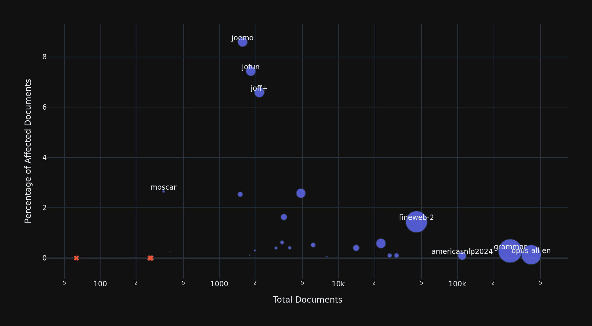
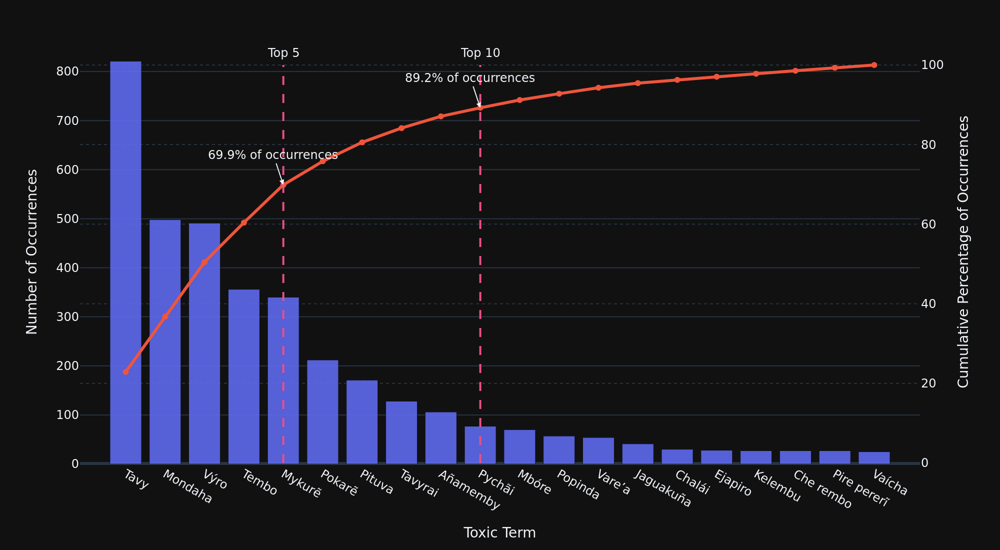
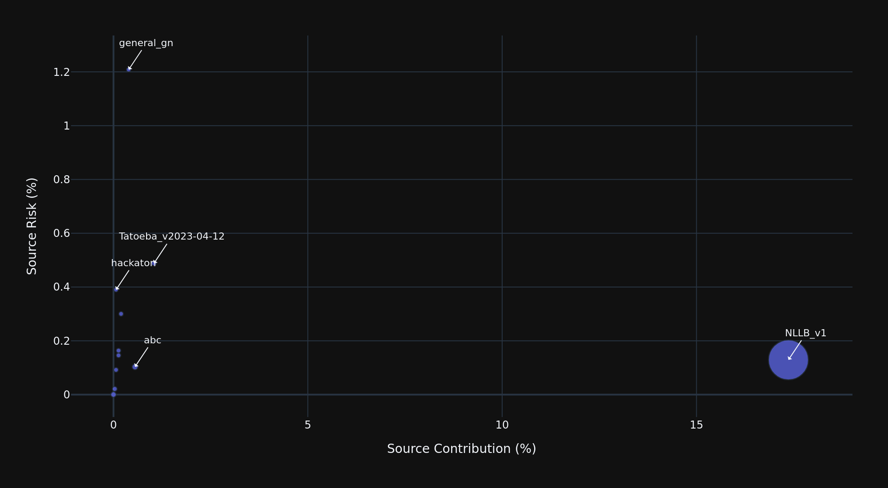
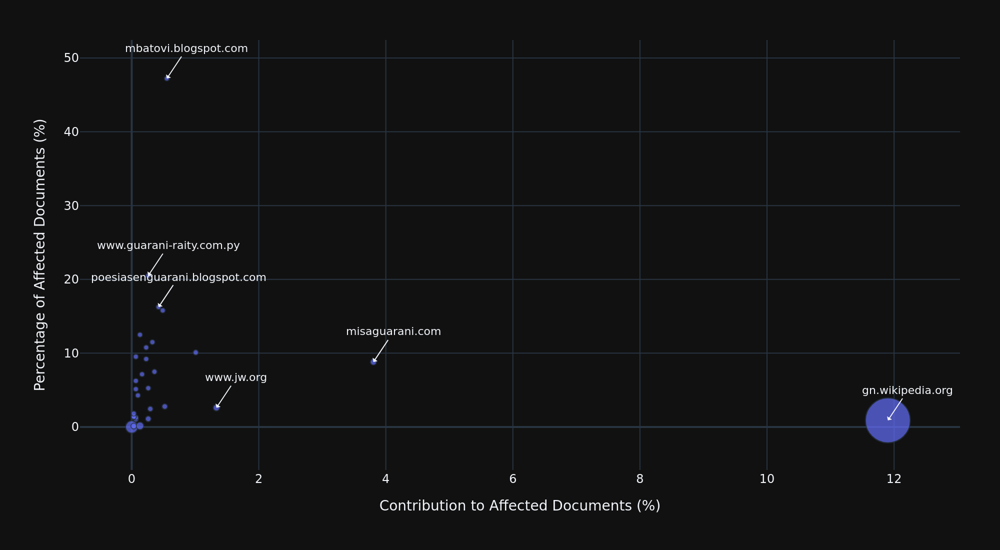

# Toxicity Filtering Experiments Report🤬📋

This report presents and analyses the results of a keyword-based toxicity filtering experiment conducted across multiple text corpora. The goal of the experiment is to evaluate the performance of the filtering method.

## Methodology⚙️
This section describes the datasets, toxic term list, and filtering procedure used throughout the experiment.

### Source Data

The source data [**`🗂️data`**](../data/existing_corpora/data/processed) consist on **26 corpora** sourced from the [**`🗃️Existing Corpora Repository`**](https://github.com/guaran-ia/existing-guarani-corpora.git), which compiles available Guarani corpora into files of a standardised form. For more information on the contents of this corpora, read their [report](https://github.com/guaran-ia/existing-guarani-corpora/blob/main/report.md).

### Toxic Term List

The words and phrases used for filtering, hereafter referred to as **toxic terms** [**`📃toxic_terms.txt`**](data/toxic_terms.txt), were manually copied from the SPL's list of [**`📘Palabras Vulgares u Ofensivas en Guarani`**](https://docs.google.com/document/d/1xXF2OvHNfR0nEbkKZYitx2OA15e0AesvNMZnZZN_ruc/edit?usp=sharing), which includes a combination of single-word and multi-word expressions. 

### Filtering Criterion

A document is considered an **affected document** if it contains **at least one term** from the list. 

Toxic terms are identified using regular expression matching with word boundaries to reduce false positives from partial matches. The individual occurrences of each term are counted independendly, so that multiple toxic terms can be identified in a singular document. Refer to [**`📄utils.py`**](src/utils.py) for the matching function.

## Summary of Results 📊

The following is a global overview of the results of the filtering process. More in-depth analyses are presented in the following sections.

- **Number of analysed corpora:** 26
- **Number of documents analysed:** 990235
- **Number of affected documents:** 3075 (0.31%)
- **Total number of toxic terms:** 3806
- **Number of distinct toxic terms:** 56
- **Toxic term density across all documents:** 0.0038
- **Toxic term density across affected documents:** 1.2377

## Corpus-Level Analysis 📚

This section examines how toxicity is distributed across individual corpora. 

### Table 1: Corpus-Level Breakdown

The table below summarizes toxicity-related statistics for each corpus. The table is ordered by corpus size, from largest to smallest, and the highest values for each column are highlighted.

| Corpus Name | Total Documents | Affected Documents | Percentage of Affected Documents | Toxic Terms | Toxic Term Density (All Documents) | Toxic Term Density (Affected Documents) |
| :---: | :---: | :---: | :---: | :---: | :---: | :---: |
| opus-all-en | 417480 | 550 | 0.13% | 570 | 0.0014 | 1.0364 |
| grammar | 277842 | **786** | 0.28% | 789 | 0.0028 | 1.0038 |
| americasnlp2024 | 109719 | 96 | 0.09% | 103 | 0.0009 | 1.0729 |
| fineweb-2 | 45397 | 655 | 1.44% | **1208** | 0.0266 | 1.8443 |
| jojajovai | 30855 | 32 | 0.10% | 32 | 0.0010 | 1.0000 |
| americasnlp2023 | 27027 | 28 | 0.10% | 28 | 0.0010 | 1.0000 |
| bible | 22818 | 133 | 0.58% | 136 | 0.0060 | 1.0226 |
| ancora | 14120 | 57 | 0.40% | 59 | 0.0042 | 1.0351 |
| flores-200 | 8024 | 4 | 0.05% | 4 | 0.0005 | 1.0000 |
| commonvoice | 6154 | 32 | 0.52% | 32 | 0.0052 | 1.0000 |
| multi-wiki-qa | 4850 | 125 | 2.58% | 187 | 0.0386 | 1.4960 |
| opus-all-es | 3907 | 16 | 0.41% | 18 | 0.0046 | 1.1250 |
| josa | 3491 | 57 | 1.63% | 61 | 0.0175 | 1.0702 |
| tatoeba | 3367 | 21 | 0.62% | 24 | 0.0071 | 1.1429 |
| apollomoedataset | 2993 | 12 | 0.40% | 33 | 0.0110 | **2.7500** |
| joff+ | 2170 | 143 | 6.59% | 157 | 0.0724 | 1.0979 |
| americasnli | 1990 | 6 | 0.30% | 6 | 0.0030 | 1.0000 |
| jofun | 1842 | 137 | 7.44% | 150 | 0.0814 | 1.0949 |
| belele | 1800 | 2 | 0.11% | 2 | 0.0011 | 1.0000 |
| joemo | 1571 | 135 | **8.59%** | 148 | **0.0942** | 1.0963 |
| gua_spa | 1500 | 38 | 2.53% | 40 | 0.0267 | 1.0526 |
| americasnlp2022 | 386 | 1 | 0.26% | 1 | 0.0026 | 1.0000 |
| moscar | 340 | 9 | 2.65% | 18 | 0.0529 | 2.0000 |
| opus | 267 | 0 | 0.00% | 0 | 0.0000 | 0.0000 |
| apollomoebench | 262 | 0 | 0.00% | 0 | 0.0000 | 0.0000 |
| culturax | 63 | 0 | 0.00% | 0 | 0.0000 | 0.0000 |
|  | **990235** | **3075** | **0.31%** | **3806** | **0.0038** | **1.2377** |

### Figure 1: Corpus Size vs. Toxicity Prevalence

> The scatter plot above compares corpus size (X-axis, log normalised) with the percentage of affected documents in the corpus (Y-axis). The dot sizes represent the number (raw count) of affected documents, while the **x** markers represent corpora without affected documents.

## Term-Level Analysis 🔤

This section focuses on the distribution and frequency of individual toxic terms.

### Table 2: Term-Level Breakdown

The table below shows the frequency of the detected toxic terms. The table is ordered from most to least frequent term, and terms from the list that were not detected are omitted.

| Term | Occurrences | Percentage of All Occurrences |
| :---: | :---: | :---: |
| Tavy | **821** | **21.57%** |
| Mondaha | 498 | 13.08% |
| Výro | 491 | 12.90% |
| Tembo | 356 | 9.35% |
| Mykurẽ | 340 | 8.93% |
| Pokarẽ | 212 | 5.57% |
| Pituva | 171 | 4.49% |
| Tavyrai | 128 | 3.36% |
| Añamemby | 106 | 2.79% |
| Pychãi | 77 | 2.02% |
| Mbóre | 70 | 1.84% |
| Popinda | 57 | 1.50% |
| Vare’a | 54 | 1.42% |
| Jaguakuña | 41 | 1.08% |
| Chalái | 30 | 0.79% |
| Ejapiro | 28 | 0.74% |
| Kelembu | 27 | 0.71% |
| Che rembo | 27 | 0.71% |
| Pire pererĩ | 27 | 0.71% |
| Vaícha | 25 | 0.66% |
| Japiro | 21 | 0.55% |
| Takuchi | 20 | 0.53% |
| Che revi | 19 | 0.50% |
| Teviro | 17 | 0.45% |
| Molde vai | 16 | 0.42% |
| Nderasóre | 11 | 0.29% |
| Tavyrón | 10 | 0.26% |
| Akã trapo | 9 | 0.24% |
| Guyra tavy | 9 | 0.24% |
| Juru palangana | 8 | 0.21% |
| Pychi’ĩ | 8 | 0.21% |
| Nde akã tembo | 6 | 0.16% |
| Ñe’ẽrei | 6 | 0.16% |
| Jurutavy | 5 | 0.13% |
| Nderevi | 5 | 0.13% |
| Añarako | 5 | 0.13% |
| Añarakópeguare | 5 | 0.13% |
| Ejapiro túnare | 5 | 0.13% |
| Kuña’i | 5 | 0.13% |
| Voli kuña | 3 | 0.08% |
| Akã pekõi | 3 | 0.08% |
| Tilinga | 3 | 0.08% |
| Lorito óga | 3 | 0.08% |
| Pysã tronco | 2 | 0.05% |
| Vaka Cháko | 2 | 0.05% |
| Anguja tupao | 2 | 0.05% |
| Tóro rembo | 2 | 0.05% |
| Lápi mbyky | 2 | 0.05% |
| Eike nde revikuápe | 1 | 0.03% |
| Añaraitypeguare | 1 | 0.03% |
| Eike nderevikuápe | 1 | 0.03% |
| Añarapypikuarapeguare | 1 | 0.03% |
| Tembo la eréa | 1 | 0.03% |
| Tatune | 1 | 0.03% |
| Molde vai arpa ryru | 1 | 0.03% |
| Jaguatĩ | 1 | 0.03% |
|  | **3806** |  |

### Figure 2. Pareto Curve of Term Frequency (Top-20)

> The Pareto Curve shows the cumulative distribution of the detected toxic terms. The Top-5 toxic terms account for **69.8829%** of all occurrences, while the Top-10 toxic terms account for **89.2359%** of occurrences. Terms outside the Top-20 most frequent terms are excluded for clarity. Refer to **Table 2** for the complete breakdown.

## Attribution Analysis 📑

This section explores the origins of the identified toxic terms and affected documents, in terms of their source and domain.

>[NOTE] As seen in their respective sections, many documents have the source and/or domain labelled as *'unknown'*, while this is included in the complete breakdowns (**Tables 3 & 4**), the unknown sources are excluded from other forms of analysis.

### Table 3: Source-Level Breakdown

This table showcases the complete stats of the sources where affected documents were found. The sources are ordered by amount of affected documents attributed to them, with the sources without affected documents being left at the bottom of the table.

| Source Name | Total Documents | Affected Documents | Percentage from Source Documents | Percentage from Affected Documents | Toxic Terms | Toxic Term Density (Total Documents) | Toxic Term Density (Affected Documents) |
| :---: | :---: | :---: | :---: | :---: | :---: | :---: | :---: |
| unknown | 526651 | **2461** | 0.47% | **80.03%** | **3149** | 0.0060 | 1.2796 |
| NLLB_v1 | 413573 | 534 | 0.13% | 17.37% | 552 | 0.0013 | 1.0337 |
| Tatoeba_v2023-04-12 | 6556 | 32 | 0.49% | 1.04% | 36 | 0.0055 | 1.1250 |
| abc | 16492 | 17 | 0.10% | 0.55% | 17 | 0.0010 | 1.0000 |
| general_gn | 993 | 12 | **1.21%** | 0.39% | 33 | **0.0332** | **2.7500** |
| anlp | 2000 | 6 | 0.30% | 0.20% | 6 | 0.0030 | 1.0000 |
| wikinews | 2744 | 4 | 0.15% | 0.13% | 4 | 0.0015 | 1.0000 |
| blogs | 2444 | 4 | 0.16% | 0.13% | 4 | 0.0016 | 1.0000 |
| seminario | 2179 | 2 | 0.09% | 0.07% | 2 | 0.0009 | 1.0000 |
| hackaton | 513 | 2 | 0.39% | 0.07% | 2 | 0.0039 | 1.0000 |
| spl | 4788 | 1 | 0.02% | 0.03% | 1 | 0.0002 | 1.0000 |
| Others | 11302 | 0 | 0.00% | 0.00% | 0 | 0.0000 | 0.0000 |
|  |  | **3075** | **0.31%** |  | **3806** | **0.0038** | **1.2377** |

### Figure 3: Source Toxicity Risk vs. Contributiobn

> The graph shows each source's toxicity risk (the percentage of the documents attributed to that source that are affected) plotted against its toxicity contribution (the percentage from all the affected documents attributed to that source). As previously mentioned, documents with their sources labelled as *'unknown'*, which represent **80.0325%** of the affected documents, are excluded from this analysis. The Top-3 sources with the most contribution and most risk are labelled.

### Table 4: Domain-Level Breakdown

This table showcases the complete stats of the domains where affected documents were found. Domains without affected documents are grouped into the 'Others' category to prevent the table from becoming, in total 678 compose this category. The domains are ordered by amount of affected documents attributed to them, with the domains without affected documents being left at the bottom of the table.

| Domain | Total Documents | Affected Documents | Percentage from Domain Documents | Percentage from Affected Documents | Toxic Terms | Toxic Term Density (Total Documents) | Toxic Term Density (Affected Documents) |
| :---: | :---: | :---: | :---: | :---: | :---: | :---: | :---: |
| unknown | 931561 | **2282** | 0.24% | **74.21%** | **2389** | 0.0026 | 1.0469 |
| gn.wikipedia.org | 40919 | 366 | 0.89% | 11.90% | 599 | 0.0146 | 1.6366 |
| misaguarani.com | 1328 | 117 | 8.81% | 3.80% | 172 | 0.1295 | 1.4701 |
| www.jw.org | 1571 | 41 | 2.61% | 1.33% | 61 | 0.0388 | 1.4878 |
| archivo.abc.com.py | 307 | 31 | 10.10% | 1.01% | 34 | 0.1107 | 1.0968 |
| mbatovi.blogspot.com | 36 | 17 | 47.22% | 0.55% | 41 | 1.1389 | 2.4118 |
| lenguaguarani.blogspot.com | 577 | 16 | 2.77% | 0.52% | 62 | 0.1075 | 3.8750 |
| www.portalguarani.com | 95 | 15 | 15.79% | 0.49% | 45 | 0.4737 | 3.0000 |
| poesiasenguarani.blogspot.com | 80 | 13 | 16.25% | 0.42% | 24 | 0.3000 | 1.8462 |
| biblics.com | 147 | 11 | 7.48% | 0.36% | 17 | 0.1156 | 1.5455 |
| aka.com.py | 87 | 10 | 11.49% | 0.33% | 15 | 0.1724 | 1.5000 |
| dgaleanolivera.wordpress.com | 367 | 9 | 2.45% | 0.29% | 11 | 0.0300 | 1.2222 |
| www.abc.com.py | 728 | 8 | 1.10% | 0.26% | 8 | 0.0110 | 1.0000 |
| idioma-guarani.blogspot.com | 152 | 8 | 5.26% | 0.26% | 26 | 0.1711 | 3.2500 |
| www.guarani-raity.com.py | 39 | 8 | 20.51% | 0.26% | 15 | 0.3846 | 1.8750 |
| guarani.blogia.com | 76 | 7 | 9.21% | 0.23% | 47 | 0.6184 | 6.7143 |
| www.datamex.com.py | 65 | 7 | 10.77% | 0.23% | 8 | 0.1231 | 1.1429 |
| portalguarani.com | 12 | 6 | 50.00% | 0.20% | 10 | 0.8333 | 1.6667 |
| domanovic.org | 11 | 6 | 54.55% | 0.20% | 14 | 1.2727 | 2.3333 |
| es.scribd.com | 7 | 6 | 85.71% | 0.20% | 24 | 3.4286 | 4.0000 |
| ea.com.py | 70 | 5 | 7.14% | 0.16% | 7 | 0.1000 | 1.4000 |
| howlingpixel.com | 19 | 5 | 26.32% | 0.16% | 8 | 0.4211 | 1.6000 |
| en.wikinews.org | 2744 | 4 | 0.15% | 0.13% | 4 | 0.0015 | 1.0000 |
| www.staff.uni-mainz.de | 32 | 4 | 12.50% | 0.13% | 5 | 0.1562 | 1.2500 |
| guaranime.blogspot.com | 70 | 3 | 4.29% | 0.10% | 4 | 0.0571 | 1.3333 |
| www.yvytupyahu.com.es | 4 | 3 | 75.00% | 0.10% | 8 | 2.0000 | 2.6667 |
| gn.m.wikipedia.org | 192 | 2 | 1.04% | 0.07% | 2 | 0.0104 | 1.0000 |
| www.mozilla.org | 157 | 2 | 1.27% | 0.07% | 4 | 0.0255 | 2.0000 |
| heraldsofhope.org | 39 | 2 | 5.13% | 0.07% | 2 | 0.0513 | 1.0000 |
| guaranime.blogspot.com.es | 32 | 2 | 6.25% | 0.07% | 2 | 0.0625 | 1.0000 |
| www.buenastareas.com | 21 | 2 | 9.52% | 0.07% | 2 | 0.0952 | 1.0000 |
| lengua-guarani.blogspot.com | 15 | 2 | 13.33% | 0.07% | 2 | 0.1333 | 1.0000 |
| www.wikiplanet.click | 14 | 2 | 14.29% | 0.07% | 2 | 0.1429 | 1.0000 |
| paraguayologia.com | 8 | 2 | 25.00% | 0.07% | 7 | 0.8750 | 3.5000 |
| issuu.com | 4 | 2 | 50.00% | 0.07% | 11 | 2.7500 | 5.5000 |
| independiente.com.py | 2 | 2 | **100.00%** | 0.07% | 2 | 1.0000 | 1.0000 |
| www.scribd.com | 2 | 2 | **100.00%** | 0.07% | 8 | **4.0000** | 4.0000 |
| elcoloo.com | 2 | 2 | **100.00%** | 0.07% | 3 | 1.5000 | 1.5000 |
| spl.gov.py | 819 | 1 | 0.12% | 0.03% | 1 | 0.0012 | 1.0000 |
| elkunumi-guarani.blogspot.com | 75 | 1 | 1.33% | 0.03% | 1 | 0.0133 | 1.0000 |
| guaraniportugues.blogspot.com | 72 | 1 | 1.39% | 0.03% | 45 | 0.6250 | **45.0000** |
| www.wol-children.net | 55 | 1 | 1.82% | 0.03% | 1 | 0.0182 | 1.0000 |
| guaraniportugues.blogspot.com.br | 12 | 1 | 8.33% | 0.03% | 1 | 0.0833 | 1.0000 |
| children.logoslibrary.eu | 12 | 1 | 8.33% | 0.03% | 1 | 0.0833 | 1.0000 |
| www.bible.com | 10 | 1 | 10.00% | 0.03% | 1 | 0.1000 | 1.0000 |
| guaranirenda.tripod.com | 9 | 1 | 11.11% | 0.03% | 1 | 0.1111 | 1.0000 |
| app.glosbe.com | 5 | 1 | 20.00% | 0.03% | 1 | 0.2000 | 1.0000 |
| kurupi.blogspot.com | 5 | 1 | 20.00% | 0.03% | 2 | 0.4000 | 2.0000 |
| www.musicaparaguaya.org.py | 4 | 1 | 25.00% | 0.03% | 1 | 0.2500 | 1.0000 |
| letras-uruguay.espaciolatino.com | 4 | 1 | 25.00% | 0.03% | 7 | 1.7500 | 7.0000 |
| caminarporlaplaya.wordpress.com | 3 | 1 | 33.33% | 0.03% | 1 | 0.3333 | 1.0000 |
| www.guarani-raity.com | 3 | 1 | 33.33% | 0.03% | 1 | 0.3333 | 1.0000 |
| www.nanduti.com.py | 3 | 1 | 33.33% | 0.03% | 3 | 1.0000 | 3.0000 |
| www.ateneoguarani.edu.py | 3 | 1 | 33.33% | 0.03% | 1 | 0.3333 | 1.0000 |
| www.edupratt.com | 2 | 1 | 50.00% | 0.03% | 1 | 0.5000 | 1.0000 |
| p3f.blogspot.com | 2 | 1 | 50.00% | 0.03% | 1 | 0.5000 | 1.0000 |
| www.slideshare.net | 2 | 1 | 50.00% | 0.03% | 1 | 0.5000 | 1.0000 |
| www.chistes1001.com | 1 | 1 | **100.00%** | 0.03% | 2 | 2.0000 | 2.0000 |
| letras.azmusica.com.br | 1 | 1 | **100.00%** | 0.03% | 1 | 1.0000 | 1.0000 |
| noticiascde.com.py | 1 | 1 | **100.00%** | 0.03% | 2 | 2.0000 | 2.0000 |
| celia.cnrs.fr | 1 | 1 | **100.00%** | 0.03% | 1 | 1.0000 | 1.0000 |
| www.poesiasolidariadelmundo.com | 1 | 1 | **100.00%** | 0.03% | 1 | 1.0000 | 1.0000 |
| www.portaldemisterios.com | 1 | 1 | **100.00%** | 0.03% | 1 | 1.0000 | 1.0000 |
| prensalibreya.blogspot.com | 1 | 1 | **100.00%** | 0.03% | 1 | 1.0000 | 1.0000 |
| www.angelfire.com | 1 | 1 | **100.00%** | 0.03% | 2 | 2.0000 | 2.0000 |
| 20medios.wordpress.com | 1 | 1 | **100.00%** | 0.03% | 1 | 1.0000 | 1.0000 |
| soyunsoberanosenor.blogspot.com | 1 | 1 | **100.00%** | 0.03% | 1 | 1.0000 | 1.0000 |
| americaxxi.com | 1 | 1 | **100.00%** | 0.03% | 1 | 1.0000 | 1.0000 |
| www.discusionez.com | 1 | 1 | **100.00%** | 0.03% | 3 | 3.0000 | 3.0000 |
| cocomagnanville.over-blog.com | 1 | 1 | **100.00%** | 0.03% | 1 | 1.0000 | 1.0000 |
| arslethei.blogspot.com | 1 | 1 | **100.00%** | 0.03% | 1 | 1.0000 | 1.0000 |
| www.ultimahora.com | 1 | 1 | **100.00%** | 0.03% | 1 | 1.0000 | 1.0000 |
| www.diariolahumanidad.com | 1 | 1 | **100.00%** | 0.03% | 1 | 1.0000 | 1.0000 |
| fernando-sabido-sanchez.blogspot.com | 1 | 1 | **100.00%** | 0.03% | 1 | 1.0000 | 1.0000 |
| chatgpt4.win | 1 | 1 | **100.00%** | 0.03% | 1 | 1.0000 | 1.0000 |
| poemasonline.com | 1 | 1 | **100.00%** | 0.03% | 1 | 1.0000 | 1.0000 |
| sibila.com.br | 1 | 1 | **100.00%** | 0.03% | 1 | 1.0000 | 1.0000 |
| evecoronel.com | 1 | 1 | **100.00%** | 0.03% | 1 | 1.0000 | 1.0000 |
| jucelinoluz.news | 1 | 1 | **100.00%** | 0.03% | 1 | 1.0000 | 1.0000 |
| corubo.bandcamp.com | 1 | 1 | **100.00%** | 0.03% | 1 | 1.0000 | 1.0000 |
| opus.nlpl.eu | 1 | 1 | **100.00%** | 0.03% | 1 | 1.0000 | 1.0000 |
| Others | 7519 | 0 | 0.00% | 0.00% | 0 | 0.0000 | 0.0000 |
|  |  | **3075** | **0.31%** |  | **3806** | **0.0038** | **1.2377** |

### Figure 4: Domain Toxicity vs. Contribution (Top-20)

> The graph shows each domain's toxicity risk (the percentage of the documents attributed to that domain that are affected) plotted against its toxicity contribution (the percentage from all the affected documents attributed to that source). The plot includes only the Top-20 domains with the most overall documents. Furthermore and as previously mentioned the documents for which the domain was labelled as *'unknown'*, which represent the **74.2114%** of all affected documents, are excluded from the analysis.

## Limitations and Future Work

The current keyword matching method relies on unified spelling of the toxic terms. As a result, instances of these terms where the spelling is different (e.g. different apostrophe or nasal tilde) are likely not matched. 

### False Positive Identification
This report doesn't account for false positive or false negative cases, as that is work that should be manually done. For false positive identification, this spreadsheet [**`Toxic Content Filtering`**](https://docs.google.com/spreadsheets/d/1vet809FK5yo7RdrYuhVrYkK19pzOHbfDl0OOck_nyxk/edit?usp=sharing) has been made available.

### Toxic Term Severity

The list of toxic terms used for identification contains vocabulary with varying degrees of offensiveness. This report doesn't account for this aspect of the affected documents. The proposal is to assign an offensiveness score to each term, and use those to calculate a similar score for each affected document to then integrate said scores into the report. The labels can be assigned in this spreadsheet [**`Toxic Term Score Assignment`**](https://docs.google.com/spreadsheets/d/13xCHU2A_ys-l5oYV_NFZbYtXZWsFd3tAXjWPte90VYY/edit?usp=sharing)